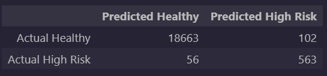
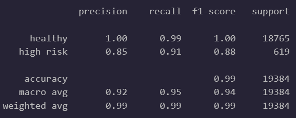
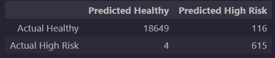

# Credit Risk Classification Model - Testing and Analysis
## Overview of the Analysis
### Purpose
Using Python to build a Supervised Machine Learing model that can predict the creditworthiness of borrowers based on the given information listed below with a high degree of accuracy.

### Our Dataset
Historical lending activity from a peer-to-peer lending services company including the following attributes:
 * Loan Size
 * Interest Rate
 * Borrower Income
 * Debt to Income
 * Number of Accounts
 * Derogatory Marks
 * Total Debt

### Our Goal
From this labeled dataset, we are attempting to successfully train a model to predict if the loans are marked as "High Risk" or "Healthy".

## Results

### Term Descriptions:
**Precision:** Number of correct positive predictions over all predicted positives (high risk loans in this case).  In simple terms, the ability of our model to avoid false positives.

**Recall:** Number of correct positive predictions over all actual positives (positives are again high risk loans in this case).  In simple terms, the ability of our model to catch all cases of positives and avoid false negatives.

**Balanced Accuracy:** Weighted average of accuracy per each class or sub-group (healthy loans vs high risk loans in our case).  In simple terms, a general measure of how often our model is correct, taking into account each group it is predicting.

### Machine Learning Model 1:
 * **Description of Model:** Logistic Regression Analysis of Original Data
 * **Balanced Accuracy Score:** 95.2%
 * **Precision Scores:**
   * Healthy Loans: 100%
   * High Risk Loans: 85%
 * **Recall Scores:**
   * Healthy Loans: 99%
   * High Risk Loans: 91%

**Confusion Matrix:**
  

**Classification Report:**

### Machine Learning Model 2:
  * **Description of Model:** Logistic Regression Analysis of Random Oversampled Data
  * **Balanced Accuracy Score:** 99.4%
  * **Precision Scores:**
    * Healthy Loans: 100%
    * High Risk Loans: 84%
  * **Recall Scores:**
    * Healthy Loans: 99%
    * High Risk Loans: 99%

**Confusion Matrix:**
  

**Classification Report:**

## Summary

